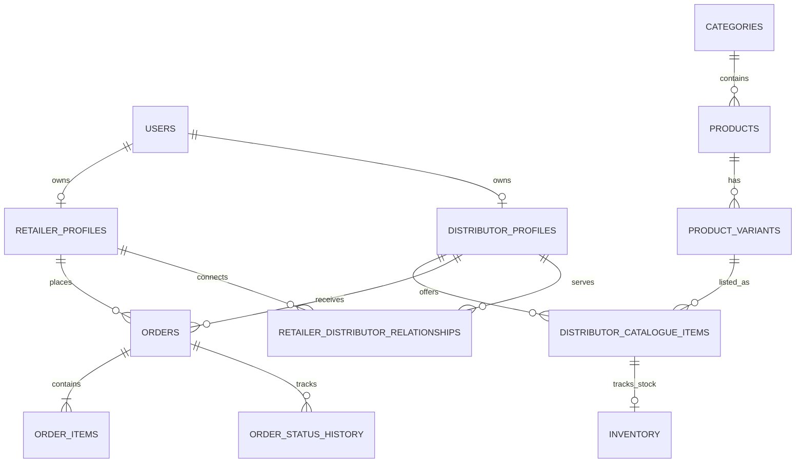

# NEXGram Database Schema & Architecture

This document details the PostgreSQL domain model foundation implemented in Phase 4.1 for the NEXGram B2B Commerce Ecosystem.

## 1. Architecture Overview

The NEXGram backend foundation is a **Modular Monolith** built with FastAPI, SQLAlchemy 2.0, and Alembic. It connects to PostgreSQL (with SQLite used as a local fallback for development/testing).

We have established a robust, relational schema designed to support thousands of products, multiple distributors per retailer, complex order histories, and deterministic business intelligence. 

## 2. Entity Relationship Diagram

## 3. Core Entities

### Canonical Product Identity
The most crucial architectural decision is the separation of Canonical Products from Distributor Offerings:
- **`products`**: The universal identity (e.g., "Amul Taaza Milk"). Handled by the platform.
- **`product_variants`**: Specific SKUs based on physical characteristics (e.g., "500ml", "1L").
- **`distributor_catalogue_items`**: The commercial offering tied to a specific distributor. Contains `selling_price`, `minimum_order_quantity`, and links to `available_stock`. This allows multiple distributors to sell the *same* canonical product at *different* prices.

### Commerce Architecture
- **`orders`**: An immutable snapshot of a transaction. A single order can contain multiple `order_items`, correctly modeling the reality of a retailer buying 15 different products from a single distributor in one go.
- **Historical Price Snapshot**: The `order_items` table captures the `unit_price` at the exact moment of creation. If a distributor raises the price in `distributor_catalogue_items` tomorrow, the historical order value remains strictly unchanged.
- **Reorder Behavior**: Reordering does not modify an existing order. It extracts the historical line items to populate a *new* procurement draft, referencing current catalogue prices.

### Intelligence Data Ownership
The deterministic engines process normalized data from these tables:
- **`demand_signals`**: Stores raw retailer activity (searches, unmet needs). 
- **`opportunities`**: Generated asynchronously by the intelligence layer to highlight supply gaps.
- **`recommendation_evidence`**: Persists the "why" behind an intelligence recommendation, allowing transparency.

## 4. Indexing & Soft Deletion Strategy
- Indexes are heavily applied on foreign keys (`retailer_id`, `distributor_id`), lookup columns (`normalized_name`, `slug`, `order_number`), and status columns to guarantee performance at scale.
- We favor soft deactivation (`is_active = False`) over hard deletion for products, categories, and catalogue items to ensure historical orders are never orphaned.

## 5. Seed Data Strategy
An initial deterministic seed (`backend/seed/initial_seed.py`) provisions the core category tree (FMCG -> Dairy/Staples), canonical products (Paneer, Milk, Atta), product variants, users, and distributor catalogue items. This allows the backend to boot in a fully functional state for testing matching algorithms.

## 6. Migration Strategy
All schema definitions are managed strictly by **Alembic**. The `alembic/versions/` directory contains linear schema progressions. `Base.metadata.create_all` is relegated strictly to the in-memory test suite.
