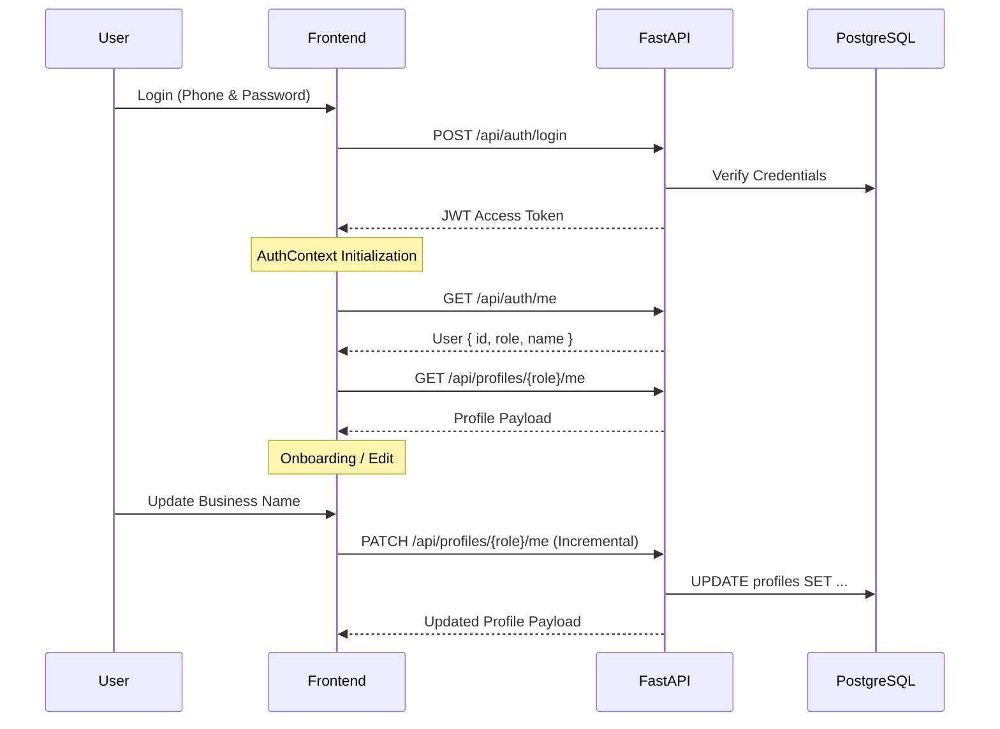

# NEXGram Profile Architecture

NEXGram has successfully migrated from client-side `localStorage` onboarding states to a server-side PostgreSQL domain model.

## Core Principles

1. **Authentication Drives Context**: `AuthContext` fetches the currently logged in `User` via JWT, and subsequently fetches the associated `Profile` (Retailer or Distributor).
2. **PostgreSQL as Source of Truth**: All business profile data (`demanded_categories`, `delivery_capabilities`, `location`) lives in PostgreSQL JSON/String columns on the `retailer_profiles` and `distributor_profiles` tables.
3. **Incremental Profile Updates**: Onboarding wizards and dashboard settings execute a `PATCH` request (`/api/profiles/{role}/me`) to incrementally save user input at every step. This prevents data loss.
4. **No LocalStorage Profiles**: The only token stored in `localStorage` is the `nexgram_access_token`. 

## Data Flow

## Schema References

- `User`: Handles identity, password hash, role (`retailer`, `distributor`).
- `RetailerProfile`: Holds retailer specific data (e.g. `business_type`, `demanded_categories`, `investment_budget`).
- `DistributorProfile`: Holds distributor specific data (e.g. `business_category`, `serviceable_pincodes`, `minimum_order_range`).

## UI Integration

- The `useAuth` hook exposes `profile` and `setProfile`.
- Components such as `OnboardingFlow`, `Dashboard`, and `useDeveloperPack` now derive their context directly from `profile.profile_data`.
